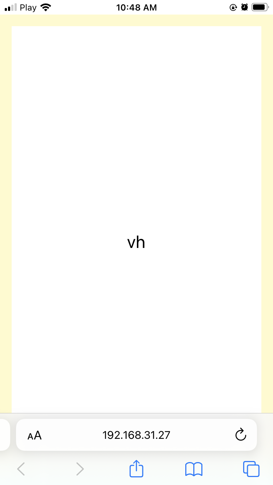
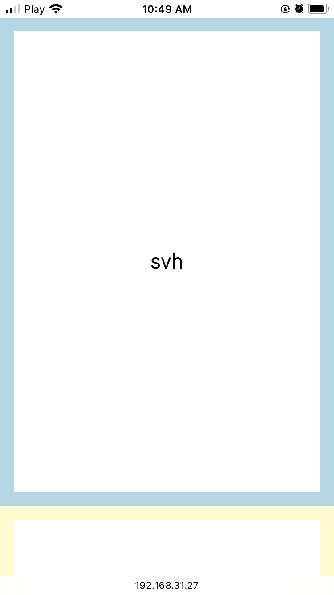
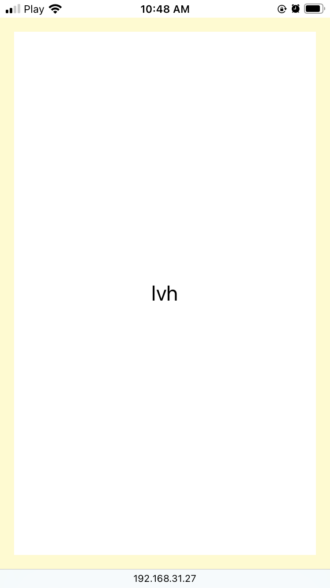
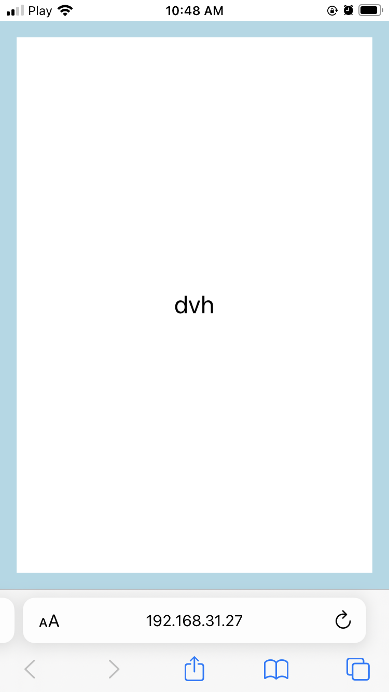
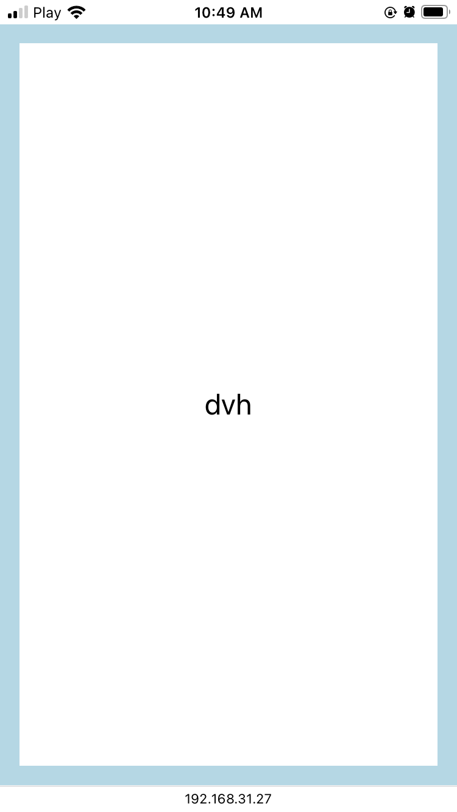

### {{title}}

Are you remember a _**vh**_ unit in CSS?

I remember, and for today I thinked that this unit is uniqe. But... I found that there is a _**svh**_ and _**lvh**_ units too. Oh, and the _**dvh**_ unit too.

#### What is the vh unit?

It's a full heigh of your device screen.

For example, if you have a 1080p screen, the **_100vh_** unit will be 1080px.

#### Svh and Lvh

That's useful for mobile browsers. Because the browser UI is overlaping page if use _**vh**_ unit.

As you can see, yellow border is under the UI.

The _**svh**_(small viewport) unit fills a full screen, but hold free space for the address bar.

The _**lvh**_(large viewport) unit it's the same, but without the address bar.

#### Dvh (greatest)

The _**dvh**_(dynamic viewport) unit it's automatically conforms. If short, your screen will always be filled with 100% regardless of browser UI.

You see, that border is always on the top of the screen.

#### Conclusion

It's interesting, I found a new super responsive _**dvh**_ unit. For mobile-first developing, it's a good thing to use insted of the _**vh**_ unit.
