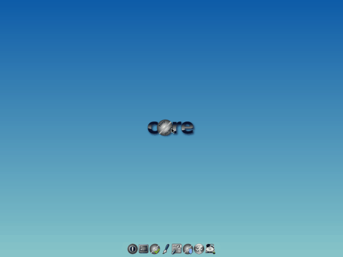
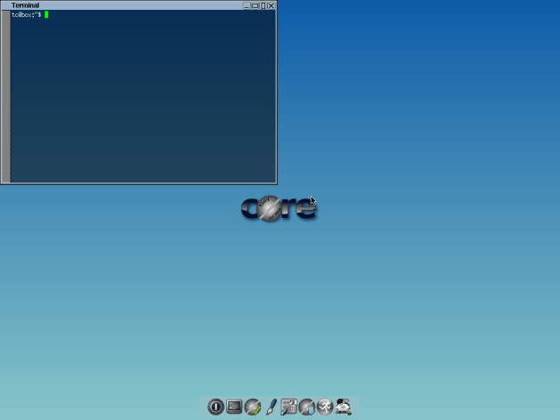

### {{ title }}

#### Tiny Core

Be ready to be amazed by Tiny Core. I bet even the smallest Windows image editor will be heavier than Tiny Core Linux. Yes, its weight is only 16 MB! Are you surprised? Downloading a low-quality video takes longer than downloading Tiny Core Linux.

About size of the distribution, we talked, now let's talk about what will amaze you: about what is inside. The system is delivered only with the most necessary programs and a minimalist interface. If you have a very old computer, install Tiny Core and get acquainted with this little wonder. It loads faster than any other known OS.

Tiny Core Linux is based on the Damn Small distribution, but currently it is completely independent. By default, Tiny Core comes with the FLTK / FKWM graphical interface and BusyBox. You will not have many things, but do not worry, if you want, you can install everything manually.

#### Types of Tiny Core Linux

We have a 3 version of Tiny Core: Core, Tiny Core and CorePlus.

-  The first version contains only CLI (Command Line Interface) and with it only experienced / advanced users will be able to work. The current version of Core weighs only 9 MB. :)

-  Tiny Core is designed for the average user who is familiar with GUI (Graphical User Interface). The current version of TinyCore has a size of only 16 MB.

-  Core Plus - it's an installation file, not a distribution. It is recommended for new users who only have access to a wireless network or those who use a non-English keyboard layout. The distribution includes the basic Core System with utilities for configuring the system: choosing from 7 window managers, support for wireless communication through many firmware files and ndlswrapper, support for non-English keyboard layout and remastering tool. The current version of CorePlus is 72 MB.

#### Minimal system requirements for Tiny Core Linux:

-  RAM: 46 Mb (recomended 64 MB)
-  CPU: Pentium 2

So here is a link: [tinycorelinux.net](http://www.tinycorelinux.net/)
