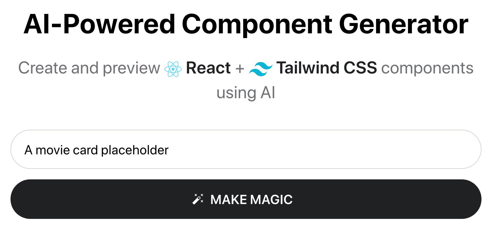
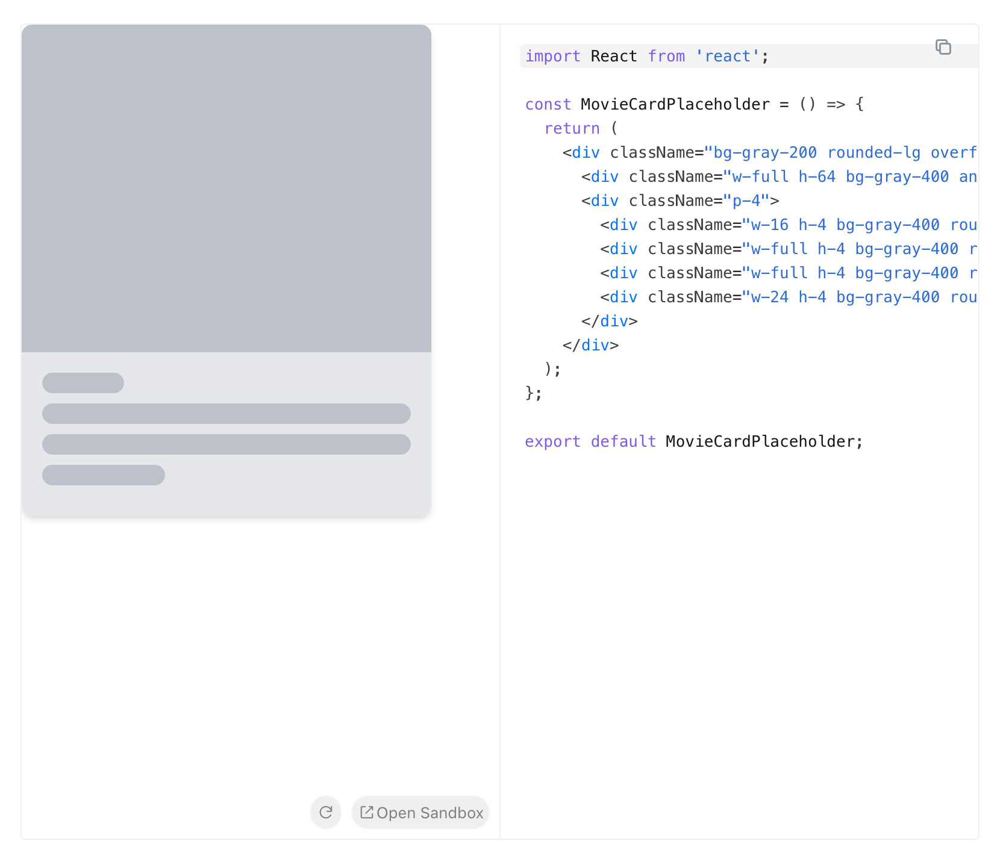
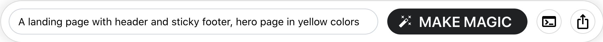
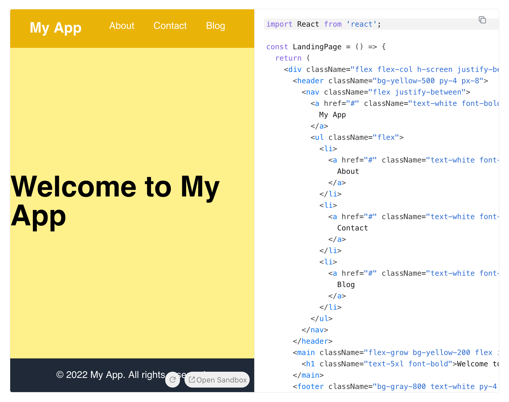
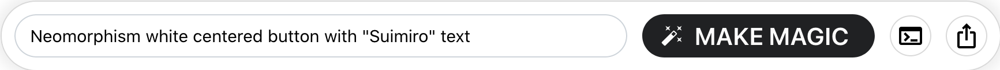
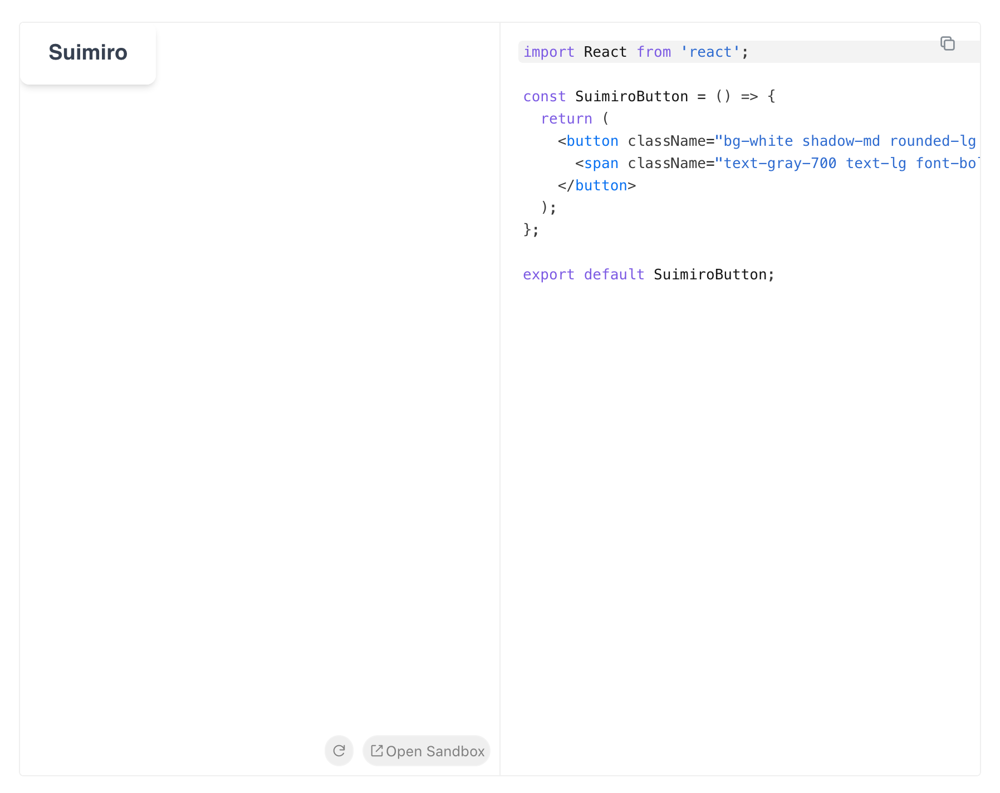
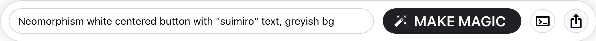
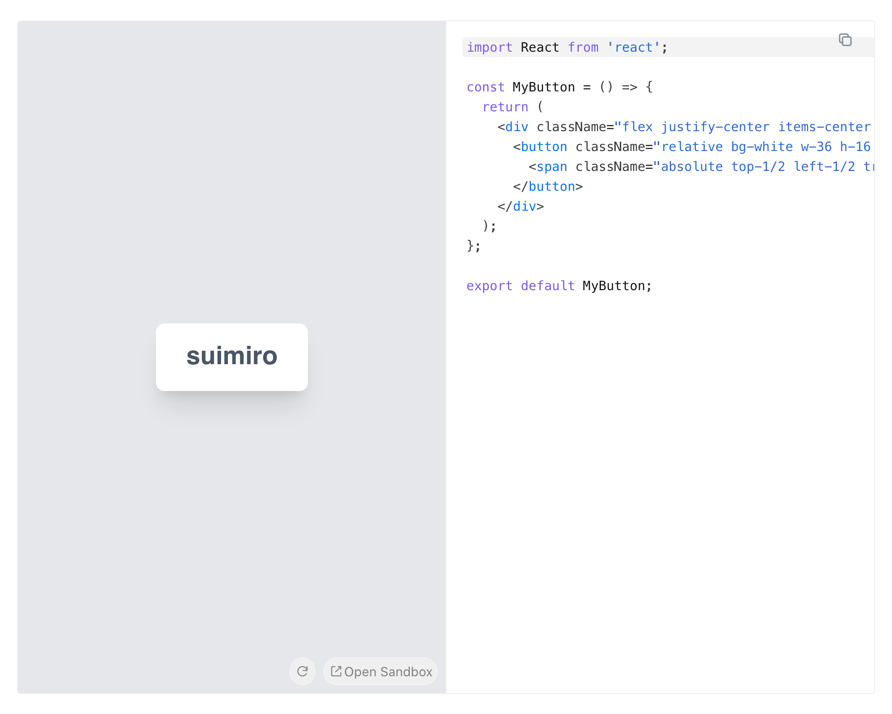

### {{title}}

So on a rise of AI tools, I found a funny components generator based on _**React**_ called [Microapp](https://www.microapp.ai/build). This thing helps you to build components with _**Tailwind**_ styles.

#### How it works?

You just need to write a promt with your preferences. For example, let me show one.

I want a simple placeholder for a _**movie card**_. Now let's see on result

Hmm, works pretty well. We got a animated placeholder by one click.

#### Full structures

Let's try to build a bigger structure. For example, a _**landing page**_.

A very simple prompt without any concrete requirements. Let's see what we got.

Oh, by the way, it's looks like a landing page. I think if prompt will be more detailed, like a link list or a footer information and contacts fields, we will get a better result.

But I give you a shot to try ot yourself 😁. I'm lazy for this things.

#### UI elements

I found, that it will be a best way to use this AI to build some _**buttons, forms, spinners,**_ etc.

"Give me a neomorphic button please"

Meh... it's not centered, let's update a prompt.

Now this is it 🥰, a component, that fully matches my requirements.

#### Conclusion

I found some bad moments in this AI.

-  It doesn't have a _**"update"**_ feature, always it will be a new component by rewriting prompt...
-  Another thing, it's a inline styles, for me better is a _**.module.css**_ files.

I think, by the time this tool will be more powerful to build a complex structures. Great, that it works with CodeSandbox, so you can edit result in realtime.

But for now, it's a good way to build some UI elements.
