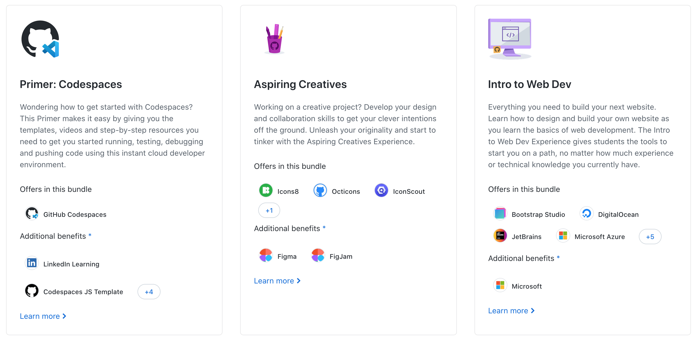
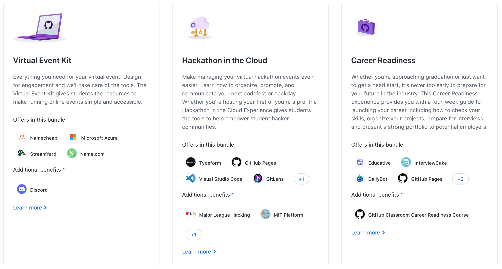

### {{title}}

#### GitHub Education Student Pack

It’s a collection of free tools and resources for students pursuing careers in technology. It includes access to popular dev tools, cloud services, and educational platforms.

#### What's included?

The pack offers a wide range of tools to help you in your learning. Here are small highlights:

-  GitHub Pro: Access unlimited private repositories, collaborate with teams and more.
-  JetBrains: Free subscription to JetBrains tools, including IntelliJ IDEA, PyCharm, and WebStorm.
-  Digital Ocean: $200 in platform credit for 1 year.
-  Namecheap: Free domain (.me) and SSL certificate for 1 year.

I also very love a GitHub Copilot, that make me lazy and write some basic structures of code for me😁.

So here I show you a kits from github:

#### How to access?

To be eligible for the pack, you must be a student who is currently enrolled in a degree course of study. If you fit, let's get started:

1. Sign in to your GitHub account (student email need to be added in settings).
2. Go to the [GitHub Education](https://education.github.com/) and click on the "Join Global Campus ". After that click blue button.
3. Verify your student status by providing proof of enrollment in a qualifying educational institution.
4. Once your status is verified, you can access all the tools and resources included in the pack.

#### Conclusion

The GitHub Education Student Pack gives awesome features to you for FREE. So, what are you waiting for? Sign up today and start exploring!
