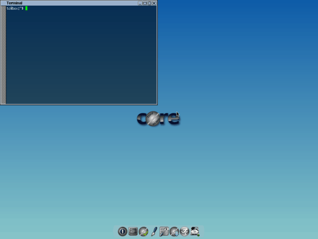

### {{ title }}

Tiny Core

Готовьтесь прийти в восторг от Tiny Core. Бьюсь об заклад, даже самое маленькое приложение для редактирования изображений на Windows будет тяжелее, чем Tiny Core Linux. Да, его вес всего лишь 16 МБ! Удивлены? Загрузка небольшого видео низкого качества занимает и то больше времени, чем загрузка Tiny Core Linux.

О размере дистрибутива мы поговорили, теперь перейдем к тому, что поразит вас: к тому, что находится внутри. Система поставляется только с самыми необходимыми программами и минималистичным интерфейсом. Если у вас остался очень древний компьютер, установите Tiny Core и познакомьтесь с этим маленьким чудом. Он загружается быстрее, чем любая другая известная ОС.

Tiny Core Linux основан на дистрибутиве Damn Small, но на данный момент он полностью независим. По умолчанию, Tiny Core идет вместе с графическим интерфейсом FLTK/FKWM и BusyBox. Многих вещей вам будет не хватать, но не волнуйтесь, если хотите, вы можете установить все это вручную.

Существует три версии Tiny Core: Core, Tiny Core и CorePlus. Первая версия содержит только CLI (Интерфейс командной строки) и с ним смогут работать только опытные/продвинутые пользователи. Текущая версия Core весит всего лишь 9 МБ. :)

Tiny Core предназначен для обычного пользователя, который знаком с GUI (Графический интерфейс пользователя). Текущая версия TinyCore имеет размер всего 16 МБ.

Core Plus — это установочный образ, а не дистрибутив. Рекомендуется новым пользователям, у которых есть доступ только к беспроводной сети или тем, кто использует не английскую раскладку клавиатуры. Дистрибутив включает в себя базовую Core System с утилитами для настройки системы: выбор из 7 менеджеров окон, поддержку беспроводной связи через множество firmware файлов и ndlswrapper, поддержку неанглийской раскладки и инструмент для ремастеринга. Размер текущей версии CorePlus — всего лишь 72 МБ.

Минимальные системные требования для Tiny Core Linux:

RAM: 46 МБ (рекомендуется 64 МБ)
CPU: Pentium 2
